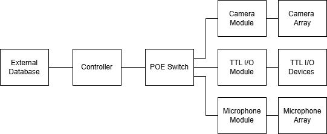

<!-- PROJECT SHIELDS -->
[![Contributors][contributors-shield]][contributors-url]
[![Forks][forks-shield]][forks-url]
[![Stargazers][stars-shield]][stars-url]
[![Issues][issues-shield]][issues-url]
[![License][license-shield]][license-url]

<!-- PROJECT LOGO -->
<br />
<div align="center">
  <h3 align="center">Modular Synchronised Data Capture System</h3>
  <p align="center">
    A modular and highly usable approach to I/O tasks within the Kind lab and beyond
    <br />
    <a href="https://github.com/Kind-Wyllie-lab/habitat"><strong>Explore the docs »</strong></a>
    <br />
    <br />
    <a href="https://github.com/Kind-Wyllie-lab/habitat/issues">Report Bug</a>
    ·
    <a href="https://github.com/Kind-Wyllie-lab/habitat/issues">Request Feature</a>
  </p>
</div>

<!-- TABLE OF CONTENTS -->
<details>
  <summary>Table of Contents</summary>
  <ol>
    <li>
      <a href="#about-the-project">About The Project</a>
      <ul>
        <li><a href="#background">Background</a></li>
        <li><a href="#system-purpose">System Purpose</a></li>
        <li><a href="#scope">Scope</a></li>
        <li><a href="#system-context">System Context</a></li>
      </ul>
    </li>
    <li>
      <a href="#getting-started">Getting Started</a>
      <ul>
        <li><a href="#prerequisites">Prerequisites</a></li>
        <li><a href="#installation">Installation</a></li>
      </ul>
    </li>
    <li><a href="#usage">Usage</a></li>
    <li><a href="#roadmap">Roadmap</a></li>
    <li><a href="#contributing">Contributing</a></li>
    <li><a href="#license">License</a></li>
    <li><a href="#contact">Contact</a></li>
  </ol>
</details>

<!-- ABOUT THE PROJECT -->
## About The Project

### Background
The habitat project seeks to explore the behaviour and development of up to 50 rodents in a single large enclosure ("the habitat"). The research is being conducted by SIDB/UofE/Kind Lab with the intention of exploring the genetic factors relating to autism in rodents. To achieve this, experimental data must be gathered. Numerous sensors and actuators are currently distributed throughout the environment - cameras, microphones, RFID, and TTL I/O. To date, measurements have been gathered manually. This is time consuming and leads to unsynchronised measurements. A modular, autonomous approach is desired. Such an approach will have externalities well beyond the Habitat project, which serves as the initial context for the system.

### System Purpose
The proposed system provides a modular, scalable, and synchronized data capture solution for behavioral testing labs. It enables precise multi-sensor data collection (video, audio, TTL events, RFID) while controlling external equipment. The controller manages synchronization, health monitoring, and data collation, while sensor modules autonomously capture and transmit data to a central repository. All power, synchronisation, control signalling and data transfer shall use a single POE (Power over Ethernet) connection.

### Scope
The system consists of a central controller with multiple PoE sensor modules. 
Planned sensor modules include cameras, microphones, TTL I/O, and RFID units.
The controller detects, synchronises, and manages these modules.
Data is collected, formatted, and stored for analysis.
The system is modular, allowing for easy expansion and maintenance.

### System Context
<!--  -->


The system includes:
- A main controller responsible for time synchronisation, data processing, and module management
- A PoE switch which connects the controller to all modules
- An external storage system which may include a NAS, SSD, USB, or database like supabase
- An array of module types, including:
  - A camera module, providing compressed video capture
  - A microphone module, recording ultrasonic mice vocalisations
  - A TTL I/O module, interfacing with various I/O devices
  - An RFID module, providing subject tracking

<!-- GETTING STARTED -->
## Getting Started

### Prerequisites
- Python 3.8 or higher
- PoE-capable network switch
- 1x Raspberry Pi 5 for controller
- 1x Raspberry Pi 5 per module, plus module specific hardware e.g. camera, audiomoth USV microphone 
- An external storage device, e.g., Synology NAS DS1522+, or perhaps a controller Pi with NVME/SSD storage 


### Installation
1. Clone the repository
   ```sh
   # Navigate to your desired working directory
   cd /path/to/your/workspace
   
   # Clone the repository
   git clone https://github.com/Kind-Wyllie-lab/habitat.git
   cd habitat
   ```

2. Run the setup script
    ```sh
    # Make sure you're in the habitat directory
    . setup.sh
    # You will be prompted to run tests. You can either choose yes or no. After this, setup is complete.
  
3. Navigate to and run device specific program
   ```sh
   # For controller
   cd src/controller/examples
   sudo chmod 755 controller.sh # Only necessary first time
   .controller.sh 

   # For a camera module
   cd src/modules/examples
   sudo chmod 755 camera.sh # Only necessary first time 
   .camera.sh

<!-- USAGE -->
## Usage
Detailed usage instructions can be found in the [System Requirements Specification document](https://github.com/Kind-Wyllie-lab/habitat/SRS.md).

<!-- ROADMAP -->
## Roadmap
- [X] Complete system architecture design
- [X] Implement core controller functionality
- [X] Develop sensor module interfaces
- [X] Implement data storage and retrieval
- [X] Add monitoring and health checks
- [ ] Graphical user interface
- [ ] REST endpoints for synchronisation with webapp and other apps
- [ ] Reliable PTP synchronisation
- [ ] Add documentation
- [ ] manifest.yoml style setup

<!-- CONTRIBUTING -->
## Contributing
Contributions are what make the open source community such an amazing place to learn, inspire, and create. Any contributions you make are **greatly appreciated**.

1. Fork the Project
2. Create your Feature Branch (`git checkout -b feature/AmazingFeature`)
3. Commit your Changes (`git commit -m 'Add some AmazingFeature'`)
4. Push to the Branch (`git push origin feature/AmazingFeature`)
5. Open a Pull Request

<!-- LICENSE -->
## License
Distributed under the MIT License. See `LICENSE.txt` for more information.

<!-- CONTACT -->
## Contact
Andrew Scott-George - ascottg@ed.ac.uk

Project Link: [https://github.com/Kind-Wyllie-lab/habitat](https://github.com/Kind-Wyllie-lab/habitat)

<!-- MARKDOWN LINKS & IMAGES -->
[contributors-shield]: https://img.shields.io/github/contributors/Kind-Wyllie-lab/habitat.svg?style=for-the-badge
[contributors-url]: https://github.com/Kind-Wyllie-lab/habitat/graphs/contributors
[forks-shield]: https://img.shields.io/github/forks/Kind-Wyllie-lab/habitat.svg?style=for-the-badge
[forks-url]: https://github.com/Kind-Wyllie-lab/habitat/network/members
[stars-shield]: https://img.shields.io/github/stars/Kind-Wyllie-lab/habitat.svg?style=for-the-badge
[stars-url]: https://github.com/Kind-Wyllie-lab/habitat/stargazers
[issues-shield]: https://img.shields.io/github/issues/Kind-Wyllie-lab/habitat.svg?style=for-the-badge
[issues-url]: https://github.com/Kind-Wyllie-lab/habitat/issues
[license-shield]: https://img.shields.io/github/license/Kind-Wyllie-lab/habitat.svg?style=for-the-badge
[license-url]: https://github.com/Kind-Wyllie-lab/habitat/blob/master/LICENSE.txt
