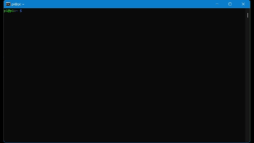
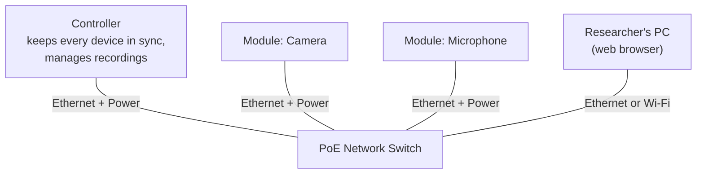

<!-- Hi! I hope you're having a good day, wherever you are :) -->
<div align="center" style="margin: 20px"> 
  
    <h3 align="center">Easy capture of multi-modal synchronised data for behavioural neuroscience using networked Raspberry Pis</h3>
</div>

<!-- PROJECT SHIELDS -->
<div align="center">

  [](#)
  [](#)
  [](#)
  [](#)
  [](#)
  [](LICENSE.txt)
  [](https://saviour.readthedocs.io/en/latest/)
  [](https://github.com/Kind-Wyllie-lab/habitat/issues)
  [](https://grabcad.com/library/saviour-pi-5-cases-v1-0-0-2)

</div>

<!-- PROJECT LOGO -->
<div align="center">

  <p align="center">
    SAVIOUR - Synchronised Audio Video Input Output Recorder.
    <br> 
    A modular and highly usable approach to synchronised, multimodal data capture using affordable open source components.
    <br>
    With a PoE switch, ethernet cables, Pi 5s and a few extra parts, you can be generating nanosecond-sync multimodal datasets all controlled from one central GUI.
    <br>
    SAVIOUR also allows for syncronising these recordings with ephysiology setups.

  </p>
</div>

⭐ Please Star us on GitHub, your support means a lot! 🙏😊

## Overview
***What is SAVIOUR?***<br>
SAVIOUR is a modular, affordable system for recording synchronised video, audio, and sensor data across multiple points in an experiment, built from low-cost networked Raspberry Pis instead of expensive proprietary hardware. 

One Pi acts as a controller, and all other Pis are specialised modules: camera modules, ultrasonic microphone modules, TTL ePhys sync modules, stimulus modules etc. 

All Pis connect together via PoE ethernet cable - simply connect your computer to the same LAN and access the GUI at *http://saviour.local* in a browser and you're ready to start making recordings.  

***What makes SAVIOUR unique?***<br>
SAVIOUR provides a framework for modular test rigs that is highly customisable and extendible to new types of module and setup. Already SAVIOUR has been used to modernise a wide variety of experiments including:
- Habitat, a large scale project that involves 24/7 recording from 16 cameras, microphones, and RFIDs over many weeks
- Active Place Avoidance, in which a special module was created to drive a rotating arena and a shock grid
- Loom, in which a special camera module was created to detect rat location using computer vision and play a loom stimulus when in a specific part of the arena  
- Acoustic startle, in which a special sound module was created to play a variety of sounds at the press of a button

Many SAVIOUR users also capture electrophysiology data in their experiments. A TTL module can be used to sync SAVIOUR's recordings to external systems such as an **Open Ephys** rig, so behavioural and neural data share a common timeline. This makes it incredibly easy to produce real-time multimodal graphs of video, audio, and neuronal activity. For more information, see https://github.com/Kind-Wyllie-lab/saviour-ephys-analysis. 

***Who is it for?***<br>
Primarily behavioural neuroscience labs, though the same approach suits any experiment needing several sensors recording in sync.

***Why was SAVIOUR made?***<br>
SAVIOUR was developed in response to many one-off data gathering rigs being created that did similar things in a messy, expensive, and hard to reproduce way.

See [About The Project](#about-the-project) below for how it works in more detail.

## Installation
### Manual Install

One line install, simply copy this into the terminal of an internet connected Pi.
```sh
curl -fsSL https://raw.githubusercontent.com/Kind-Wyllie-lab/saviour/main/install.sh | bash
```

After completion, run the following and select the correct configuration (e.g. controller, APA or module, camera)
```
sudo saviour-config
```



### Using a pre-baked image

Not yet available. Eventually an OS image will be available which can be copied on to an SD card. 

## Usage
So, you've installed SAVIOUR and configured a Controller Pi and one or more Module Pis. What more remains to be done?

Not much. Just plug them together, then complete first-time setup on the controller.

### First-time setup

1. **Open the web UI.** With everything plugged into the switch and powered on, browse to `http://saviour.local` from a PC on the same network (or use the controller's IP address if `.local` name resolution doesn't work on your network).
2. **Log in.** There's no default password - the first login attempt generates a random one and saves it on the controller. Retrieve it by running, on the controller:
   ```sh
   sudo cat /etc/saviour/admin_credentials
   ```
   Use this to log in, then change it to something memorable via `sudo saviour-config` -> "Reset web UI admin password", or the in-app change-password option.
3. **Note the Samba (file share) credentials**, needed if you or your lab want to browse recordings directly from your own PC:
   ```sh
   sudo cat /etc/saviour/samba_credentials
   ```
   These can likewise be reset via `sudo saviour-config` -> "Reset Samba share password".
4. **Check Ready.** Before your first recording, use the "Check Ready" button in the web UI to confirm all modules are connected and PTP clock sync has settled.


## Docs
Full documentation can be found at https://saviour.readthedocs.io/en/latest/ 

<!-- ABOUT THE PROJECT -->
## About The Project
SAVIOUR was created in response to two problems: 
1. Many behavioural test rigs were "re-inventing the wheel" each time, often at cost and in messy, unreplicable ways
2. Habitat (a large rig monitoring up to 50 rats for months at a time) demanded a modular approach to manage complexity and replication

A SAVIOUR system consists of a "controller" device talking to one or more "module" devices (camera, microphone, RFID reader, TTL I/O, etc.), each handling one sensor or piece of equipment. All devices are Raspberry Pi 5 (for now!), connected together via LAN, typically with Power-over-Ethernet (PoE) so a single cable carries both power and network to each device. Researchers control everything - starting and stopping recordings, checking device status - from a web page on their own PC.


```mermaid
graph TD
    Switch["PoE Network Switch"]
    Controller["Controller<br/>keeps every device in sync,<br/>manages recordings"]
    Module1["Module: Camera"]
    Module2["Module: Microphone"]
    Researcher["Researcher's PC<br/>(web browser)"]

    Controller ---|"Ethernet + Power"| Switch
    Module1 ---|"Ethernet + Power"| Switch
    Module2 ---|"Ethernet + Power"| Switch
    Researcher ---|"Ethernet or Wi-Fi"| Switch
```

The key problem SAVIOUR solves is **synchronisation**: every device's clock is kept aligned to within microseconds of the others, so a video frame from one camera, an audio sample from a microphone, and an RFID read can always be lined up afterwards, even though they were captured by completely separate little computers scattered around the room. This synchronisation isn't limited to SAVIOUR's own devices - a TTL module can send or receive timing pulses to line up SAVIOUR's recordings with an entirely separate system, such as an electrophysiology rig running Open Ephys.

<!-- CONTRIBUTING -->
## Contributing
SAVIOUR is designed to be easily extensible to new types of modules and new user interfaces to control them in experiment specific ways.
Any contributions you make are **greatly appreciated**.

### Branches
- main - The latest release of saviour e.g. v1.2
- staging - This branch is used for final testing of new releases
- fix/ - Prefix for a branch in which a fix is developed
- feat/ - Prefix for a branch in which a new feature is developed
- refactor/ - Prefix for a branch in which a refactor is implemented

### Commits
Use the conventional commits framework wherever possible
https://www.conventionalcommits.org/en/v1.0.0/#summary 

### Style
Style is enforced by ruff (ruff check/ruff format); it's PEP 8 based with an 88-character line length.

### Workflow 
1. Fork the Project
2. Create your Feature Branch (`git checkout -b feat/AmazingNewModule`)
3. Commit your Changes (`git commit -m 'feat: Create AmazingNewModule'`)
4. Push to the Branch (`git push origin feat/AmazingNewModule`)
5. Open a Pull Request between your branch and the "staging" branch
6. When the changes are stable, staging will be given a tag for a new release and this will be merged with main - your AmazingNewModule is now part of SAVIOUR!

<!-- LICENSE -->
## License
Distributed under the MIT License. See `LICENSE.txt` for more information.

<!-- CONTACT -->
## Contact
Andrew Scott-George - ascottg@ed.ac.uk

Patrick Spooner - p.a.spooner@ed.ac.uk
