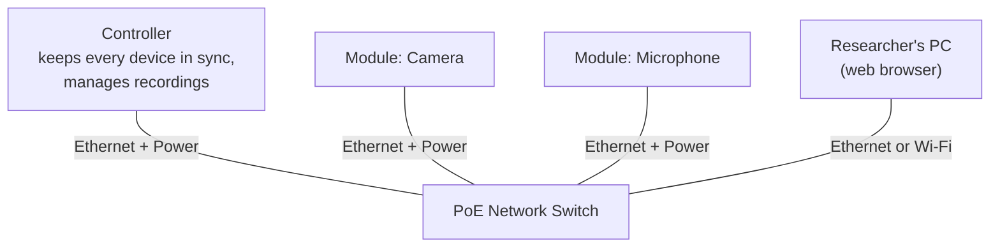

<!-- Hi! I hope you're having a good day, wherever you are :) -->
<div align="center" style="margin: 20px"> 
  
    <h3 align="center">Synchronised Audio-Video Input-Output Recorder</h3>
</div>

<!-- PROJECT SHIELDS -->
<div align="center">

  [](#)
  [](#)
  [](#)
  [](#)
  [](#)
  [](LICENSE.txt)
  [](https://saviour.readthedocs.io/en/latest/)
  [](https://github.com/Kind-Wyllie-lab/habitat/issues)
  []("https://grabcad.com/library/saviour-pi-5-cases-v1-0-0-2")

</div>

<!-- PROJECT LOGO -->
<div align="center">

  <p align="center">
    A modular and highly usable approach to synchronised, multimodal data capture using affordable open source components.
  </p>
</div>

⭐ Please Star us on GitHub: your support means a lot! 🙏😊

## Overview
***What is SAVIOUR?***<br>
SAVIOUR is a modular, affordable system for recording synchronised video, audio, and sensor data across multiple points in an experiment - built from low-cost networked computers instead of expensive proprietary hardware. A TTL module can also sync SAVIOUR's recordings to external systems such as an **Open Ephys** electrophysiology rig, so behavioural and neural data share a common timeline.

***Who is it for?***<br>
Primarily behavioural neuroscience labs, though the same approach suits any experiment needing several sensors recording in sync.

***Why was SAVIOUR made?***<br>
SAVIOUR was developed in response to many one-off data gathering rigs being created that did similar things in a messy, expensive, and hard to reproduce way.

See [About The Project](#about-the-project) below for how it works in more detail.

## Installation
### Manual Install

One line install, simply copy this into the terminal of an internet connected Pi.
```sh
curl -fsSL https://raw.githubusercontent.com/Kind-Wyllie-lab/saviour/main/install.sh | bash
```

After completion, run the following and select the correct configuration (e.g. controller, APA or module, camera)
```
sudo saviour-config
```

### Using a pre-baked image

Not yet available. Eventually an OS image will be available which can be copied on to an SD card. 

## Usage
So, you've installed SAVIOUR and configured a controller pi and one or more module pi's. What more remains to be done?

Not much. Just plug them together.


## Docs
Full documentation can be found at https://saviour.readthedocs.io/en/latest/ 

<!-- ABOUT THE PROJECT -->
## About The Project

### Background
The habitat project seeks to explore the behaviour and development of up to 50 rodents in a single large enclosure ("the habitat"). The research is being conducted by SIDB/UofE/Kind Lab with the intention of exploring the genetic factors relating to autism in rodents. To achieve this, experimental data must be gathered. Numerous sensors and actuators are currently distributed throughout the environment - cameras, microphones, RFID, and TTL I/O. To date, measurements have been gathered manually. This is time consuming and leads to unsynchronised measurements. A modular, autonomous approach is desired. Such an approach will have externalities well beyond the Habitat project, which serves as the initial context for the system.

### System Purpose
The proposed system provides a modular, scalable, and synchronized data capture solution for behavioral testing labs. It enables precise multi-sensor data collection (video, audio, TTL events, RFID) while controlling external equipment. The controller manages synchronization, health monitoring, and data collation, while sensor modules autonomously capture and transmit data to a central repository. All power, synchronisation, control signalling and data transfer shall use a single POE (Power over Ethernet) connection.

### How It Works
A SAVIOUR system consists of a "controller" device talking to one or more "module" devices (camera, microphone, RFID reader, TTL I/O, etc.), each handling one sensor or piece of equipment. All devices are Raspberry Pi 5 (for now!), connected together via LAN, typically with Power-over-Ethernet (PoE) so a single cable carries both power and network to each device. Researchers control everything - starting and stopping recordings, checking device status - from a web page on their own PC.


```mermaid
graph TD
    Switch["PoE Network Switch"]
    Controller["Controller<br/>keeps every device in sync,<br/>manages recordings"]
    Module1["Module: Camera"]
    Module2["Module: Microphone"]
    Researcher["Researcher's PC<br/>(web browser)"]

    Controller ---|"Ethernet + Power"| Switch
    Module1 ---|"Ethernet + Power"| Switch
    Module2 ---|"Ethernet + Power"| Switch
    Researcher ---|"Ethernet or Wi-Fi"| Switch
```

The key problem SAVIOUR solves is **synchronisation**: every device's clock is kept aligned to within microseconds of the others, so a video frame from one camera, an audio sample from a microphone, and an RFID read can always be lined up afterwards, even though they were captured by completely separate little computers scattered around the room. This synchronisation isn't limited to SAVIOUR's own devices - a TTL module can send or receive timing pulses to line up SAVIOUR's recordings with an entirely separate system, such as an electrophysiology rig running Open Ephys.

### Scope
The system consists of a central controller with multiple PoE sensor modules. 
Sensor modules include cameras, microphones, TTL I/O, and RFID units.
The controller detects, synchronises, and manages these modules.
Data is collected, formatted, and stored for analysis.
The system is modular, allowing for easy expansion and maintenance.

Each system includes:
- A main controller responsible for time synchronisation, data processing, and module management
- A PoE switch which connects the controller to all modules
- A storage dump which is likely a samba share running on the controller, a NAS or other dedicated device
- An array of modules, including:
  - A camera module, providing compressed video capture
  - A microphone module, recording ultrasonic mice vocalisations
  - A TTL I/O module, interfacing with various I/O devices
  - An RFID module, providing subject tracking

<!-- CONTRIBUTING -->
## Contributing
SAVIOUR is designed to be easily extensible to new types of modules and new user interfaces to control them in experiment specific ways.
Any contributions you make are **greatly appreciated**.

### Branches
- main - The latest release of saviour e.g. v1.2
- staging - This branch is used for final testing of new releases
- fix/ - Prefix for a branch in which a fix is developed
- feat/ - Prefix for a branch in which a new feature is developed
- refactor/ - Prefix for a branch in which a refactor is implemented

### Commits
Use the conventional commits framework wherever possible
https://www.conventionalcommits.org/en/v1.0.0/#summary 

### Workflow 
1. Fork the Project
2. Create your Feature Branch (`git checkout -b feat/AmazingNewModule`)
3. Commit your Changes (`git commit -m 'feat: Create AmazingNewModule'`)
4. Push to the Branch (`git push origin feat/AmazingNewModule`)
5. Open a Pull Request between your branch and the "develop" branch
6. When a number of changes have been accumulated in the "develop" branch, this will be merged with "staging"
7. When the changes are stable, staging will be given a tag for a new release and this will be merged with main - your AmazingNewModule is now part of SAVIOUR!

<!-- LICENSE -->
## License
Distributed under the MIT License. See `LICENSE.txt` for more information.

<!-- CONTACT -->
## Contact
Andrew Scott-George - ascottg@ed.ac.uk

Project Link: [https://github.com/Kind-Wyllie-lab/saviour](https://github.com/Kind-Wyllie-lab/saviour)


