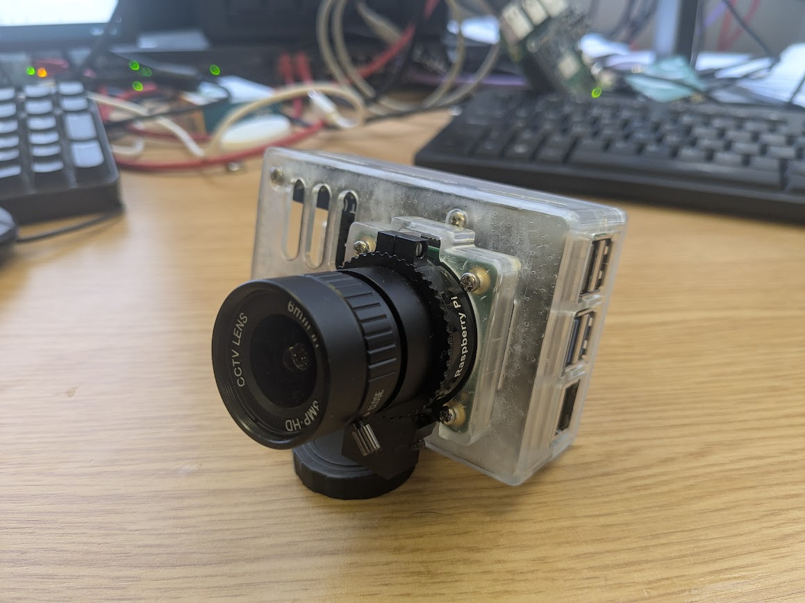

# CAD Files
## [SAVIOUR 3D Printed Cases v1](https://grabcad.com/library/saviour-pi-5-cases-v1-0-0-2)

These were the earliest deployed versions of the SAVIOUR cases. They come in two halves and screw together using standoffs to get the spacing right from the Pi assembly. They have since been replaced with snap-fit cases that do not require additional standoffs, but they are still functional and very robust.