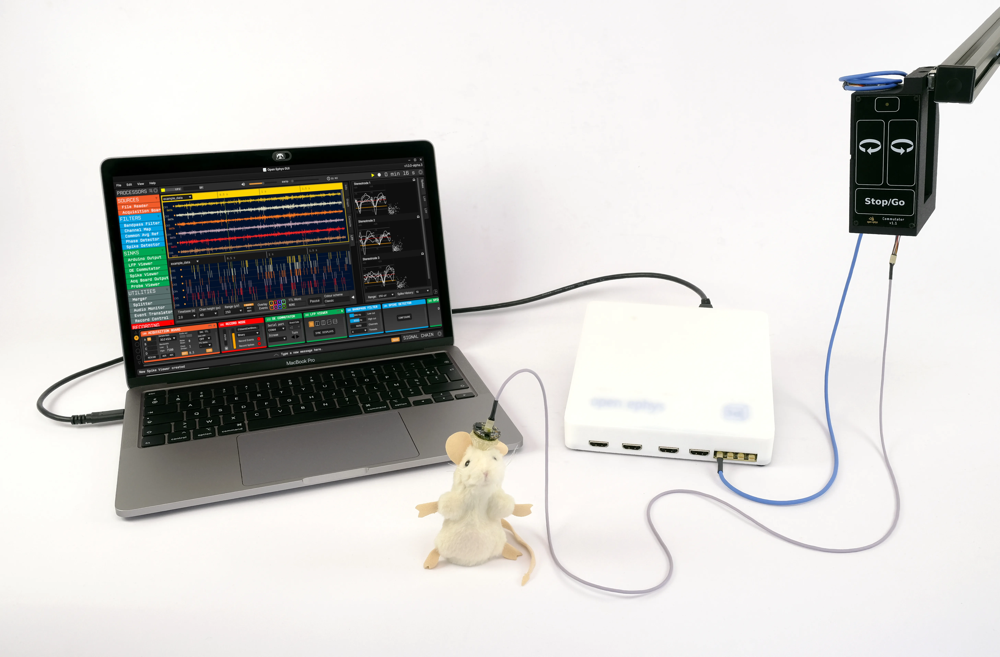
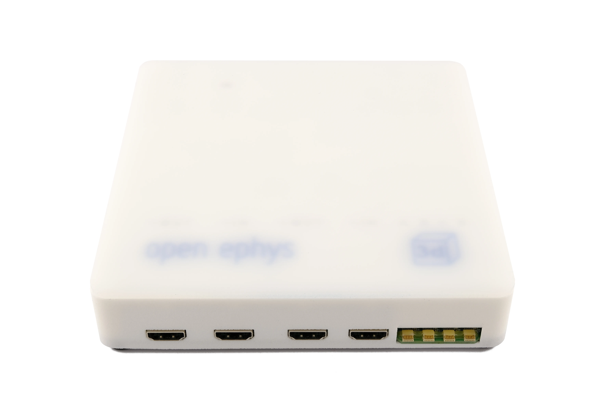
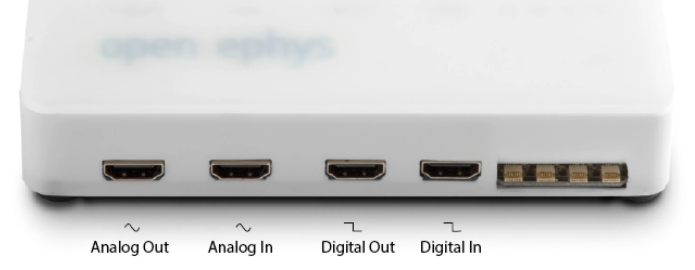
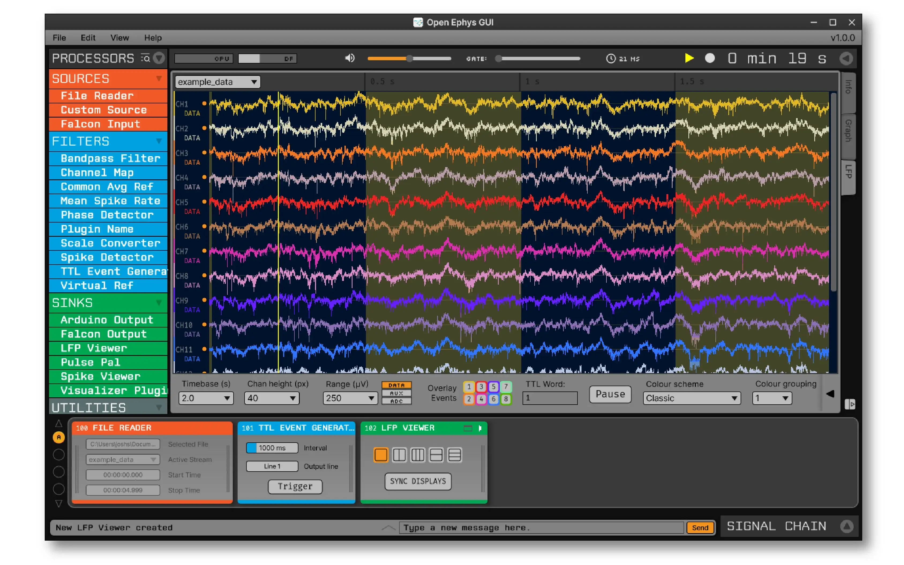

# Using SAVIOUR with Open Ephys

**IMPORTANT**: read this guide, and double check everything is working correctly before hitting record! Researchers have lost hours of data because a cable was plugged into the wrong port of their HDMI board.

The acquisition board itself, up close:

On the back of it are four HDMI ports for digital I/O - SAVIOUR only ever uses **Digital In**.

Each HDMI port carries 8 TTL channels, so you'll need an IO board to break the HDMI connector out into individual BNC connectors before you can wire a single channel to a TTL module. SAVIOUR only needs one of those 8 channels on Digital In - a pseudorandom pulse train for alignment, per the steps below. The other 7 channels on that same port are free for anything else you want logged alongside the ephys data - an experiment-start signal, a stimulus trigger, a lever press, whatever your experiment needs.

## Syncing SAVIOUR to an ephys acquisition system

1. Wire a shared TTL line between the ephys acquisition system and a TTL module input pin so both systems see the same sync pulses.
2. Recording an input pin logs each pulse edge with a PTP-disciplined timestamp, in the same clock domain as every camera/microphone/TTL module on the network.
3. On the ephys side, log the same pulses against its own acquisition clock - the shared pulses are your alignment reference between the two clocks.

Once wired up correctly, each channel's pulses show up directly in the Open Ephys GUI as coloured columns overlaid on the recording - one colour per input channel, so you can see exactly which channel fired, and when, right alongside the neural data it's aligning.

## Sending sync pulses out to the ephys rig

1. Configure a TTL module output pin (fixed-interval or pseudorandom pulse train) and wire it into a spare digital/sync input on the acquisition system.
2. Start the pulse train before recording begins so there are reference edges throughout the whole session, not just at the start.
3. A pseudorandom (non-periodic) pulse train is easier to align unambiguously than a fixed-rate one if a few pulses are missed on either side.

## Aligning ephys data post-hoc

1. Export the TTL module's per-pulse timestamp CSV alongside the ephys recording.
2. Match pulse edges between the two logs to fit a clock offset (and drift, if the ephys clock isn't disciplined) between ephys time and SAVIOUR/PTP time.
3. Apply that mapping to bring spike times, video frames and any other module's timestamps into one common timeline.

For more information and tooling, see the dedicated [saviour-ephys-analysis](https://github.com/Kind-Wyllie-lab/saviour-ephys-analysis) repository.
